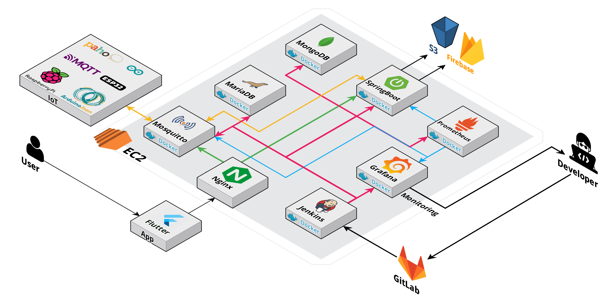
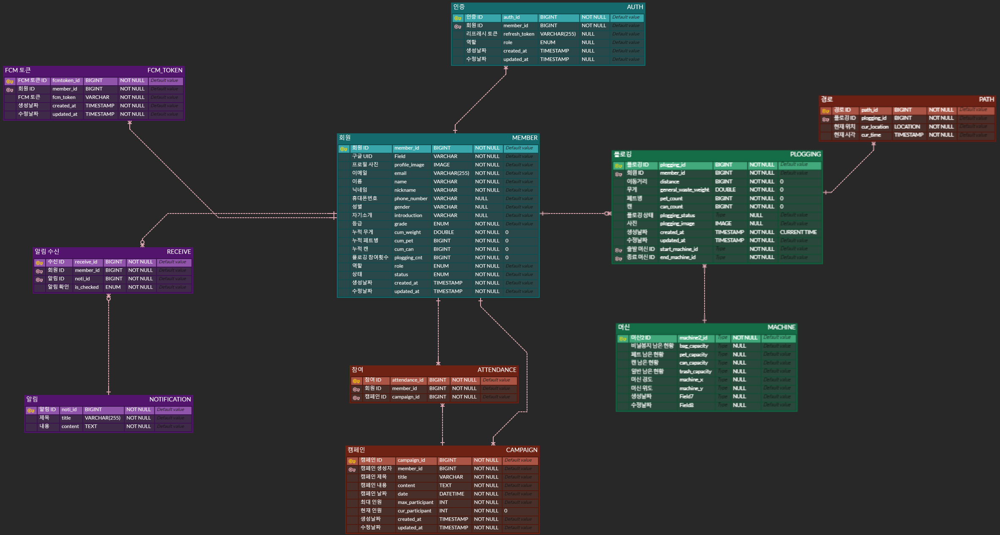

# SSAFY 9기 자율프로젝트

# A310 푸르깅


<p style="text-align:left;"></p>

## **0️⃣ 프로젝트 개요**

🎈 프로젝트명 : **Purugging**🌍🌿

📌 프로젝트 컨셉 : IoT를 활용한 플로깅 서비스

🛠 개발 기간 : 23.10.09 ~ 23.11.17 (6주)

🧑🏻 팀원 : 인정환, 김한주, 손세이, 조윤상, 채현종, 하정호

💻 사용 기술스택 : Flutter, SpringBoot, AWS + (4. 시스템 아키텍처 참고)


## **1️⃣ 팀원 정보 및 업무 분담 내역**

<table>
  <tr>
    <td align="center"><a href="https://github.com/jeonghwanin"><br /><sub><b>인정환</b></sub></a><br /><sub><b>팀장, Embedded</b></sub></td>
    <td align="center"><a href="https://github.com/Koneweekk"><br /><sub><b>김한주</b></sub></a><br /><sub><b>FE</b></sub></td>
    <td align="center"><a href="https://github.com/seyi103"><br /><sub><b>손세이</b></sub></a><br /><sub><b>Embedded</b></sub></td>
    <td align="center"><a href="https://github.com/YOUNPRIZE"><br /><sub><b>조윤상</b></sub></a><br /><sub><b>BE</b></sub></td>
	<td align="center"><a href="https://github.com/hjongc"><br /><sub><b>채현종</b></b></sub></a><br /><sub><b>BE</b></sub></td>     
	<td align="center"><a href="https://github.com/hso8706"><br /><sub><b>하정호</b></sub></a><br /><sub><b>BE</b></sub></td>
  </tr>
</table>


| 이름          | 역할          | 설명                                                         |
| ------------- | ------------- | ------------------------------------------------------------ |
| 인정환 (팀장) | Embedded      | H/W 프레임 제작<br />H/W 시스템 설계<br />스텝 모터 드라이버 구현<br />재활용 쓰레기 분류 기능 구현(초음파 센서, 조도 센서, LED)<br />Main Logic 설계<br />MQTT Protocol을 활용한 서버 통신 |
| 김한주        | Frontend(App) | Flutter를 활용한 모바일 어플리케이션 제작<br />Google Map 이동 경로 트래킹<br />QR Code와 MQTT를 통한 Server와 IoT 간 통신 구현<br />Figma를 활용한 와이어프레임, 목업 제작 |
| 손세이        | Embedded      | H/W 설계 (3D Modeling, Laser Cutting 도면 설계)<br />ESP32 통신 시스템 구현<br />RPI 사용자 인증 시스템 구현(QR 인식, MQTT 통신) |
| 조윤상        | Backend       | Notification Domain 담당<br />Jenkins를 활용한 CI/CD 구축<br />Docker 및 EC2를 활용한 서버 배포<br />Nginx를 활용한 Reverse Proxy 설정<br />Grapana & Prometheus를 활용한 모니터링 구축<br />ERD 설계 |
| 채현종        | Backend       | 프로젝트 주제 기획 <br />Member Domain 담당 <br />초기 인프라 구축 <br />MongoDB를 활용한 경로 기능 구현 <br />OAuth를 활용한 소셜 로그인 구현 (Flutter & SpringBoot) <br />ERD 설계 <br />발표 |
| 하정호        | Backend       | Skeleton code 작성(Example domain 및 common)<br />Plogging Domain 담당<br />Machine Domain 담당<br />Campaing Domain 담당<br />IoT-Server-App MQTT 통신 구현 (Broker: Mosquitto)<br />ERD 설계 |


## **2️⃣ 서비스 대표 기능**

| 기능        | 주기능                 | 상세 기능                           |
| ----------- | ---------------------- | ----------------------------------- |
| 1. 회원     | 1.1 소셜 로그인        | 1.1.1 Google OAuth 로그인           |
|             | 1.2 회원 정보 수정     | 1.2.1 닉네임 변경                   |
|             | 1.3 회원 탈퇴          | 1.3.1 회원 탈퇴 기능                |
|             | 1.4 로그아웃           | 1.4.1 로그아웃 기능                 |
|             | 1.5 마이페이지         |                                     |
| 2. 플로깅   | 2.1 플로깅 실행        | 2.1.1 QR 생성 및 표시               |
|             |                        | 2.1.2 지도 표시                     |
|             |                        | 2.1.3 완료 사진 등록                |
|             |                        | 2.1.4 주변 인원 알림                |
|             | 2.2 로그 (히스토리)    | 2.2.1 플로깅 로그 리스트            |
|             |                        | 2.2.2 시간 조회                     |
|             |                        | 2.2.3 거리 조회                     |
|             |                        | 2.2.4 쓰레기통 정보 조회            |
|             |                        | 2.2.5 사진 및 마무리 결과 조회      |
|             |                        | 2.2.6 플로깅 기록                   |
| 3. 커뮤니티 | 3.1 사용자 개최 모임   |                                     |
|             | 3.2 캠페인             | 3.2.1 캠페인 조회, 추가, 수정, 삭제 |
| 4. 쓰레기통 | 4.1 쓰레기통 상태 확인 | 4.1.1 쓰레기통별 일반 쓰레기 확인   |
|             |                        | 4.1.2 쓰레기통별 재활용 쓰레기 확인 |
|             | 4.2 비닐봉투 상태 확인 | 4.2.1 쓰레기통별 비닐봉투 양 확인   |
| 5. 알림     | 5.1 캠페인 알림        |                                     |
|             | 5.2 플로깅 종료 알림   |                                     |


## 3️⃣ 서비스 화면

<h2>시작</h2>


<h2>구글 소셜 로그인 및 회원가입</h2>


<h2>캠페인 관련 서비스</h2>

### 캠페인 생성


### 캠페인 조회 (본인 주최)

.gif)

### 캠페인 조회 (타인 주최)

.gif)

<h2>플로깅</h2>

### 플로깅 시작


### 플로깅 진행


### 플로깅 종료


### 플로깅 리스트


### 플로깅 조회


### 플로깅 이미지


<br/>

## 4️⃣ 시스템 아키텍처 및 개발 환경

<h4>System Architecture</h4>



</br>

<h4>🌐 공통</h4>

| 상세               |       내용        |
| ------------------ | :---------------: |
| GitLab             |     형상 관리     |
| Jira               | 일정 및 이슈 관리 |
| Mattermost         |   커뮤니케이션    |
| Notion             | 일정 및 문서 관리 |
| Postman            |   API 문서 관리   |
| IntelliJ           |        IDE        |
| Visual Studio Code |        IDE        |
| Android Studio     |        IDE        |

</br>

<h4>📱 FrontEnd</h4>

| 상세                |  버전   |
| ------------------- | :-----: |
| Flutter             | 3.13.8  |
| Dart                |  3.1.4  |
| google_maps_flutter |  2.5.0  |
| geolocator          | 10.1.0  |
| mqtt_client         | 10.0.0  |
| Android SDK         | 20 이상 |

</br>

<h4>💾 BackEnd</h4>

| 상세                        |  버전   |
| :-------------------------- | :-----: |
| JDK (Zulu)                  | 11.0.19 |
| SpringBoot                  | 2.7.16  |
| Spring Data JPA             | 2.7.16  |
| Spring Integration          | 2.7.16  |
| Spring Integration MQTT     | 5.5.19  |
| Eclipse paho client mqtt v3 |  1.2.5  |
| MariaDB                     | 8.0.35  |
| MongoDB                     |  2.0.1  |
| Ubuntu                      |  20.04  |
| Nginx                       | 1.18.0  |
| Docker                      | 24.0.7  |
| Docker-compose              | 2.23.0  |
| Jenkins                     | 2.414.3 |

</br>

<h4>⛏ Embedded</h4>

| 상세          |  버전  |
| :------------ | :----: |
| ESP32         |        |
| Arduino IDE   | 2.2.1  |
| ESPMqttClient | 1.13.3 |
| ArduinoJson   | 6.21.3 |
| HX711         | 0.3.9  |
| Ticker        | 4.4.0  |
| Raspberry Pi  |        |
| Paho-mqtt-c   | 3.3.1  |

</br>

## 5️⃣ 컴포넌트 구조 및 프로토타입

<h4>📱 App</h4>

```markdown
📂 android
  ㄴ📂 app
  	ㄴ📂 src
  	ㄴ🐘 build.gradle
  	ㄴ📄 google-services.json
  ㄴ📂 gradle/wrapper
  ㄴ🐘 build.gradle
  ㄴ🐘 gradle.properties
  ㄴ🐘 settings.gradle
📂 assets
  ㄴ📂 font
  ㄴ📂 image
  ㄴ📂 logo
📂 ios
📂 lib
  ㄴ📂 models
  	ㄴ📄 campaign_model.dart
  	ㄴ📄 machine_model.dart
  	ㄴ📄 plogging_model.dart
  	ㄴ📄 user_model.dart
  ㄴ📂 screens
  	ㄴ📂 campaign
  	ㄴ📂 plogging
  	ㄴ📂 profile
  	ㄴ📂 start
  	ㄴ📄 home_screen.dart
  	ㄴ📄 main_screen.dart
  ㄴ📂 services
  	ㄴ📄 auth_service.dart
  	ㄴ📄 campaign_services.dart
  	ㄴ📄 google_map_services.dart
  	ㄴ📄 machine_services.dart
  	ㄴ📄 member_services.dart
  	ㄴ📄 permission_services.dart
  	ㄴ📄 plogging_services.dart
  	ㄴ📄 qr_services.dart
  	ㄴ📄 time_services.dart
  ㄴ📂 widgets
  	ㄴ📂 bottom
  	ㄴ📂 campaign
  	ㄴ📂 home
  	ㄴ📂 plogging
  	ㄴ📂 profile
  	ㄴ📂 shared
  	ㄴ📂 start
  ㄴ📄 firebase_options.dart
  ㄴ📄 main.dart
📂 linux
📂 macos
📂 test
📂 web
📂 windows
📄 .gitignore
📄 .metadata
📄 analysis_options.yaml
📄 pubspec.lock
📄 pubspec.yaml
```

<h4>💾 BackEnd</h4>

```markdown
📂 src/main/java
  ㄴ📦 com.puru.purugging
  	ㄴ📄 PuruggingApplication.java
  	ㄴ📦 campaign
    ㄴ📦 common
    	ㄴ📦 connectionCheck
    	  	ㄴ📄 ConnectionCheckController.java
    	ㄴ📦 exception
    	  	ㄴ📄 CommonErrorCode.java
    	  	ㄴ📄 CustomException.java
    	  	ㄴ📄 ErrorCode.java
    	  	ㄴ📄 GlobalExceptionHandler.java
    	ㄴ📦 model
    		ㄴ📄 BaseTimeEntity.java
    	ㄴ📦 mqtt
    		ㄴ📦 config
    			ㄴ📄 MessageGateway.java
    			ㄴ📄 MqttIntegrationConfig.java
    		ㄴ📦 service
    			ㄴ📄 MqttMessageHandler.java
    			ㄴ📄 MqttPublisher.java
    	ㄴ📦 pagination
    		ㄴ📄 MultiResponseDto.java
    		ㄴ📄 PageInfo.java
    	ㄴ📦 response
    		ㄴ📄 FailResponseDto.java
    		ㄴ📄 ResponseFactory.java
    		ㄴ📄 SuccessResponseDto.java
    ㄴ📦 global
    	ㄴ📦 config
    		ㄴ📄 FirebaseConfig.java
    		ㄴ📄 S3Config.java
    	ㄴ📦 exception
    		ㄴ📄 S3ErrorCode.java
    		ㄴ📄 S3Exception.java
    	ㄴ📦 memberInfo
    		ㄴ📄 MemberInfo.java
    		ㄴ📄 MemberInfoArgumentResolver.java
    	ㄴ📦 storage
    		ㄴ📄 S3Uploader.java
    	ㄴ📦 util
    		ㄴ📄 ImageUtil.java
    	ㄴ📦 vo
    		ㄴ📄 Image.java
    		ㄴ📄 ImageType.java
    		ㄴ📄 Location.java
  	ㄴ📦 machine
  	ㄴ📦 member
  	ㄴ📦 notification
  	ㄴ📦 plogging
📂 src/main/resources
    ㄴ📄 application.yml
    ㄴ📄 application-mq.yml
    ㄴ📄 application-s3.yml
    ㄴ📄 prometheus.yml
    ㄴ📄 firebase-service-account.json
📄 .gitignore
🐳 docker-compose.yml
🐳 Dockerfile
🐘 build.gradle
🐘 gradlew
🐘 gradlew.bat
🐘 settings.gradle
```

<h4>⛏ Embedded</h4>

```
📂 RPI3/api
  ㄴ📂 include
  	ㄴ📄 QR.h
  	ㄴ📄 UserAuthentication.h
  ㄴ📂 src
  	ㄴ📄 QR.cpp
  ㄴ📄 main.cpp
📂 arduino_mega2560
  ㄴ📂 api
  ㄴ📄 main.ino
📂 docs/convention
📂 images
📂 models
  ㄴ📂 3d
  ㄴ📂 laser
📂 test
```


## 6️⃣ 데이터베이스 모델링 (ERD)




## 7️⃣ Convention

<h3>Commit Convention</h3>

```
## Feat        : 새로운 기능의 추가
## Fix         : 버그 수정
## Style       : CSS 등 사용자 UI 디자인 변경
## Refactor    : 코드 리팩토링
## Test        : 테스트(테스트 코드 추가/수정/삭제)
## Docs        : 문서(문서 추가/수정/삭제)
## Chore       : 빌드 업무 수정, 패키지 매니저 수정
## Rename      : 파일 혹은 폴더명을 수정하거나 옮기는 작업만 하는 경우
## Cicd        : 배포
## Env         : 환경설정 파일 추가/수정/삭제
```

* git commit -s 로 signed-off-by 표시
* Commit Message 양식

```
[Docs] Update README.md
<blank>
This commit updates README.md
<blank>
Signed-off-by: 인정환 <injog@naver.com>
```

<h3>Jira Convention</h3>

* Basic Rule

```
- 스프린트는 보통 한 주 단위로 진행됩니다. 한 주가 시작할 때마다 스프린트를 시작해주세요.
- 매주 월요일 오전에 스크럼 회의를 통해 이번 주 할 일을 논의하여 백로그에 등록하고, 스프린트에 올려 스프린트를 시작해주세요.
- 에픽(큰 틀)은 큰 단위의 공통된 분류(회의, 기획, 설계, FE개발, BE개발, EM개발, 발표 등)로 등록해주세요. 스토리, 작업에는 정답이 없습니다. 팀 내에서 상의하여 룰을 정한 후 지켜주시면 됩니다.
- 모든 이슈는 에픽과 연동되어야 하며, 스토리포인트와 담당자도 등록되어 있어야 합니다.
- 스토리포인트는 1포인트당 1시간을 의미하며, 한 주의 워킹데이에 맞게 등록해주세요!
- 한 issue당 4포인트 넘게 부여하는 것은 지양해주세요. (한 업무당 4시간을 넘게 배당한다는 것은 효율적으로 일을 하지 못했다는 인상을 줍니다.)
- issue는 진행상황에 따라 할 일, 진행 중, 완료로 옮겨가며 진행하시면 됩니다.
```


## 8️⃣ Git Flow

```
master
develop
└ FE frontend
	└ feature
		└ domain명
└ BE backend
	└ feature
		└ domain명
└ EM embedded
	└ feature
		└ domain명
```

* master : develop 브랜치에서 테스트 완료 후 master 브랜치로 병합 (버전) 

* develop : 각 파트 브랜치에서 develop 브랜치로 병합 후 테스트
