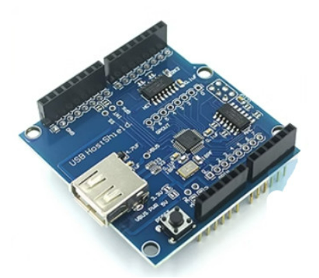

# Hard ware test 

## Board
1. [아두이노 메가 2560 R3 호환 보드 MEGA 2560 CH340](https://smartstore.naver.com/misoparts/products/5377683398?NaPm=ct%3Dlo7ypmor%7Cci%3Dcheckout%7Ctr%3Dppc%7Ctrx%3Dnull%7Chk%3D0586b32bb562a6546aea39dfc8afca82dac4ade8)
- {: width="300" height="300"}

## Sensor
1. [아두이노 4선식 로드셀 무게센서(5kg)](https://eduino.kr/product/detail.html?product_no=325#none)
- {: width="300" height="300"}
2. [CMOS QR코드 스캐너 모듈](https://www.devicemart.co.kr/goods/view?no=10826185)
- {: width="300" height="300"}
3. [전류 센서 모듈](https://eduino.kr/product/detail.html?product_no=85)
- {: width="300" height="300"}
4. [초음파 센서(HC-SR04)](https://www.devicemart.co.kr/goods/view?no=1076851)
- {: width="300" height="300"}

## Actuator
1. [CIF 4234 스텝모터](https://www.coupang.com/vp/products/205027972?itemId=603374476&vendorItemId=4581396959&src=1042503&spec=10304984&addtag=400&ctag=205027972&lptag=10304984I603374476V4581396959&itime=20231012142237&pageType=PRODUCT&pageValue=205027972&wPcid=16215522298732445116426&wRef=&wTime=20231012142237&redirect=landing&gclid=Cj0KCQjwj5mpBhDJARIsAOVjBdoOwRblhmtowIyzBRK5mfmxfrbFUUqz-vHkvduU-4xNxY2FhUKRfz8aAhUjEALw_wcB&mcid=cb6a60d3b701477dbcb3d678d9e18bb0&campaignid=20594956462&adgroupid=&network=&isAddedCart=)
- {: width="300" height="300"}

2. [WIFI ESP8266 모듈](https://eduino.kr/product/detail.html?product_no=48)
- {: width="300" height="300"}

3. [아두이노 LM386 디지털 앰프 모듈](https://www.devicemart.co.kr/goods/view?no=1290797)
- {: width="300" height="300"}

## Expand Shield
1. [USB host shield 2.0](https://smartstore.naver.com/misoparts/products/8757643606?NaPm=ct%3Dlo7ynjvu%7Cci%3Dcheckout%7Ctr%3Dppc%7Ctrx%3Dnull%7Chk%3Dd356bd186d7e893e15414cb0043d579bc9b9ca0f)
- {: width="300" height="300"}