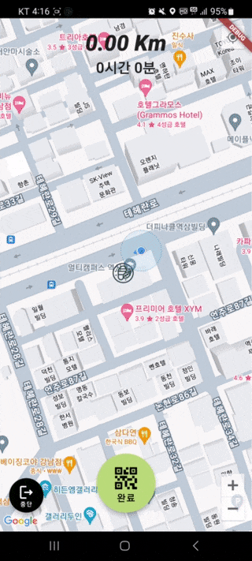

# 시연 시나리오

<h2>어플리케이션 시작</h2>

<h2>구글 소셜 로그인 및 회원가입</h2>

<h2>캠페인 관련 서비스</h2>

### 캠페인 생성

### 캠페인 조회 (본인 주최)

.gif)

### 캠페인 조회 (타인 주최)

.gif)

<h2>플로깅</h2>

### 플로깅 시작

### 플로깅 진행

### 플로깅 종료

### 플로깅 리스트

### 플로깅 조회

### 플로깅 이미지

